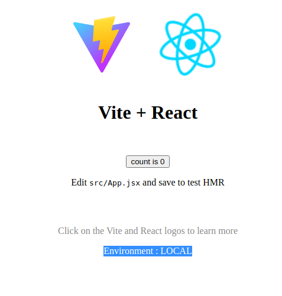
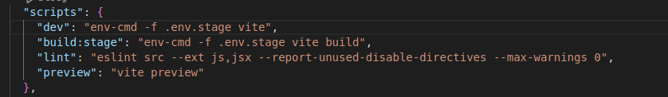
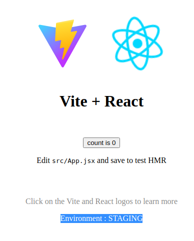
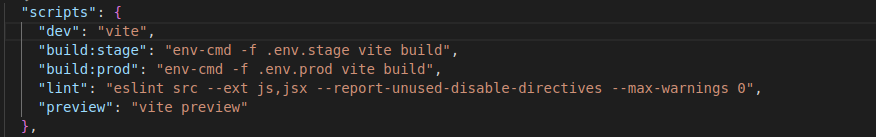
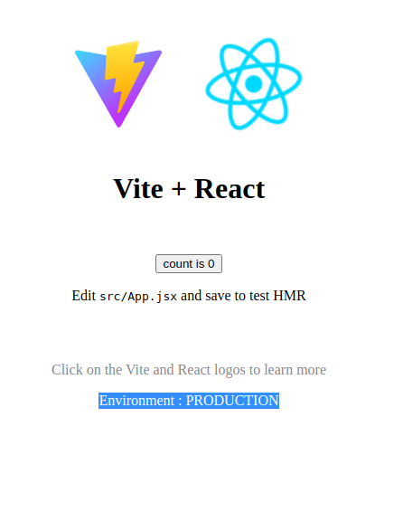
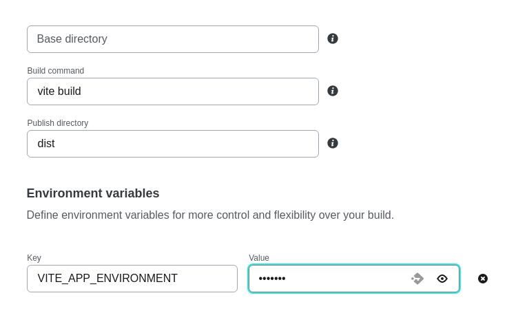

# Deployement

### Live Link for Staging build : [https://luminous-nasturtium-a789df.netlify.app/](https://luminous-nasturtium-a789df.netlify.app/)

### Live Link for Production build : [https://frabjous-faloodeh-14a0d2.netlify.app/](https://frabjous-faloodeh-14a0d2.netlify.app/)

## Environments that are commonly used in the development and deployment process :

### Development Environment:

- This is the environment where developers write, test, and debug their code. It typically includes a local development server, a code editor or integrated development environment (IDE), and tools for debugging and inspecting the application. Developers can make changes to the code and see the immediate results without affecting the production environment.

### Staging Environment:

- The staging environment is used to test the application in an environment that closely resembles the production environment. It is often used to conduct integration testing, performance testing, and user acceptance testing (UAT). The staging environment helps ensure that the application works as expected before deploying it to the production environment.

### Production Environment:

-The production environment is where the web application is deployed and made available to end users. It typically runs on production servers, which are optimized for performance, reliability, and security.

### Why to keep environment variables in seperate files?

- Keeping environment variables in separate files enhances security, simplifies configuration management, improves collaboration, enables version control, and enhances the portability and scalability of applications. It is considered a best practice to separate sensitive and environment-specific configuration from the application code.

### WorkFlow:

#### Local Environment:

- Step-1: Created Repository and Three branches named **main**,**stage**,and **dev**.
- Step-2: Created initial App structure of vite app using following command:

```bash
    npm create vite@latest
```

- Step-3: In **dev** Branch created **.env** file and added environment Variable:

```bash
    VITE_APP_ENVIRONMENT=LOCAL
```

- - also included .env in gitignore as it may contain sensitive information.

- Step-4: Include this in App.jsx or wherever you want to access environment variables.

```bash
    # {import.meta.env.Variable_name}
    # Added this in App.jsx
    Environment : {import.meta.env.VITE_APP_ENVIRONMENT}

```

- Step-4: Run following command to start development server:

```bash
    npm run dev
```

-Step-5: Output:



#### Staging Environment:

- Step-6: Install following:

```bash
    npm install -g serve
    npm install env-cmd
```

- Step-7: In **stage** branch Create another env called **.env.stage** and add environment variable:

```bash
    VITE_APP_ENVIRONMENT=STAGING
```

- Step-8: Modify package.json



**Or we can directly use it by creating simple .env file(instead of .env.stage) and no need to use env-cmd for that.**

- Step-9: run following commands:

```bash
    npm run build:stage #creates a dist folder

    serve -s dist #Serves site locally
```

- Step-10: Output:



#### Production Environment:

- Step-11: In **main** branch Create another env called **.env.prod** and add environment variable:

```bash
    VITE_APP_ENVIRONMENT=PRODUCTION
```

- Step-12: Modify package.json, add script for production build



- Step-13: run following commands:

```bash
    npm run build:prod #creates a dist folder

    serve -s dist #Serves site locally
```

- Step-14: Output:



### Making stage and main branch live on netlify:

- add environment variables on netlify for both the branches seperately :


